# Tugas Besar Unity
# IF3210 Pengembangan Aplikasi pada Platform Khusus

# Anggota
1. Gde Anantha Priharsena - 13519026
2. Reihan Andhika Putra - 13519043
3. Reyhan Emyr Arrosyid - 13519167

# Deskripsi Aplikasi
Survival Shooter: Extended adalah sebuah game ekstensi dari Survival Shooter dari Unity Learn yang dibangun pada platform Unity dengan bahasa pemrograman C#. Game ini memiliki beberapa spesifikasi antara lain:  
    
1. Attribute Player 
   Setiap atribut ditampilkan pada layar. Setiap atribut memiliki nilai awal dan batas maksimal tertentu.
   - Power  
    Menyatakan kekuatan shoot pemain.
   - Speed  
    Menyatakan kecepatan pemain dalam bergerak.
   - Health  
    Menyatakan jumlah nyawa pemain.
2. Orbs 
    Terdapat beberapa objek orb yang dapat diambil oleh player untuk meningkatkan atribut pemain secara permanen. Orb akan muncul random secara periodik pada terrain yang bisa dilalui.pemain. Setelah beberapa waktu, jika tidak diambil oleh player, orb akan hilang dari map.
   - Power Orb 
    Meningkatkan kekuatan shoot pemain.
   - Speed Orb 
    Meningkatkan kecepatan pemain dalam bergerak.
   - Health Orb 
    Meningkatkan jumlah nyawa pemain.
3. Mobs 
    Tambahkan beberapa mobs pada game, di antaranya:
   - Zombunny 
    Mobs boneka zombie yang berbentuk kelinci, memiliki serangan skala kecil.
   - Zombear 
    Mobs boneka zombie yang berbentuk beruang, memiliki serangan skala menengah.
   - Hellephant 
    Mobs boneka zombie yang berbentuk gajah, memiliki serangan skala besar.
   - Skeleton 
    Mobs berbentuk vulture yang tidak bisa bergerak, namun bisa menyerang dari jauh dengan Earth Shatter.
   - Bomber 
    Mobs berbentuk Lava Leaper ini bergerak dua kali lebih cepat dari musuh biasa, dengan tujuan meledakkan diri (self-suicide).
   - Boss 
    Mobs ini memiliki ukuran dan nyawa yang lebih besar dari mob biasa.
4. Game Mode 
   - Zen Mode 
    Mirip seperti game asli, namun hasil skor berdasarkan waktu survival.
   - Wave Mode 
       1. Setiap wave memiliki kapasitas bobot (weight) untuk musuh yang akan di-spawn.
       2. Setiap wave memiliki pool musuh yang mungkin keluar.
       3. Musuh semakin sulit untuk tiap wave, dalam kata lain tiap wave memiliki kapasitas bobot yang meningkat.
       4. Setiap wave dengan nomor kelipatan 3, akan memiliki sebuah boss mobs sebagai lawan dan beberapa mobs lain. Boss mob ini tidak memiliki bobot.
       5. Terdapat jumlah maksimal 10 Wave
       6. Pada wave ini, setiap musuh yang dibunuh memberikan skor yang telah ditentukan.
5. Weapon Upgrade 
    Weapon dapat di-upgrade agar menjadi lebih kuat. Berikut adalah weapon upgrade yang dapat dilakukan Player:
   - Diagonal Weapon 
    Menambahkan 2 bullet ke arah diagonal kiri dan kanan.
   - Faster Weapon 
    Meningkatkan kecepatan tembak senjata.
   - Highly Penetration Weapon 
    Meningkatkan kekuatan penetrasi senjata.
6. Camera View  
   Perspektif player dapat diubah sesuai dengan preferensi pemain. Berikut adalahn camera view yang dapat dipilih oleh Player:
    - TPS Mode 
        Perspektif sudut pandang orang ketiga yang membuat player dapat melihat dari atas.
    - FPS Mode 
        Perspektif sudut pandang orang pertama yang membuat player di belakang senjata.
  
7. Local Scoreboard 
   Menampilkan riwayat skor hasil permainan, terurut dari skor terbaik dan memiliki halaman untuk masing-masing Game Mode berbeda.
   - Scoreboard untuk Zen / Endless Mode menampilkan nama pemain, dan waktu survival. 
   - Scoreboard untuk Wave Mode menampilkan nama pemain, wave terjauh dan skor total yang didapat dalam satu kali bermain. 
  
8.  Main Menu 
   Terdapat settings untuk mengatur beberapa hal berikut: 
    - Menentukan nama pemain.
    - Memilih Game Mode.
    - Membuka Local Scoreboard.
  
9.  Game Over 
    Saat permainan selesai, tampilkan layar Game Over yang menampilkan performa hasil permainan bergantung Game Mode:
    - Zen Mode  
        Menampilkan waktu survival permainan.
    - Wave Mode 
        Menampilkan wave dan skor yang didapat.

# Cara Kerja Game

## Attribute Player
Attribute player pada game akan ditampilkan pada sebelah kiri atas layar saat game sudah dimulai (baik Zen Mode maupun Wave Mode). Attritue player akan ditampilkan secara terurut yaitu Power, Speed, dan Health. Untuk attribute health, terdapat visualisasi tambahan yaitu Health Bar yang ada di sebelah kiri bawah layar.

## Orbs
Orbs dapat digunakan Player untuk menambah attribute player secara permanen. Untuk menggunakan orbs, Player dapat mengambil orbs sebelum orbs tersebut hilang dari layar permainan. Jika player mengambil orbs berwarna hijau, attribute power akan bertambah. Jika player mengambil orbs berwarna kuning, attribute speed akan bertambah. Jika player mengambil orbs berwarna merah, attribute health akan bertambah.

## Mobs
Mobs akan muncul pada game sesuai dengan aturan yang berlaku pada mode yang dipilih user. Setiap mobs memiliki jenis serangan dan kecepatan yang berbeda-beda. Player harus membunuh mobs tersebut untuk bertahan dan memenangkan game.

## Game Mode
Terdapat dua jenis mode yang dapat dipilih oleh Player yaitu Zen Mode dan Wave Mode. Untuk memilih game mode, Player dapat menuju Main Menu. Klik Play. Kemudian klik dropdown Game Mode dan memilih game mode yang diinginkan. Kemudian klik Start untuk memulai permainan.

## Weapon Upgrade
Dalam sebuah kondisi tertentu, Player dapat melakukan weapon upgrade. Hal ini juga dapat diketahui dengan munculnya tulisan "Upgrade is Available" diatas pilihan-pilihan waepon upgrade. Untuk melakukan upgrade Diagonal Weapon, ketik 1. Untuk melakukan upgrade Faster Weapon, ketik 2. Untuk melakukan upgrade Highly Penetration Weapon, ketik 3.

## Camera View
Terdapat dua jenis camera view yang dapat dipilih oleh Player yaitu TPS dan FPS. Untuk memilih camera view, Player dapat menuju Main Menu. Klik Play. Secara default, tombol FPS dalam posisi unchecked. Check tombol FPS untuk memilih camera view FPS dan Uncheck tombol FPS untuk memilih camera view TPS. Kemudian klik Start untuk memulai permainan.

## Local Scoreboard
Terdapat dua jenis local scoreboard yang dapat dilihat oleh Player yaitu Zen Mode Scoreboard dan Wave Mode Scoreboard. Untuk memilih game mode, Player dapat menuju Main Menu. Klik Scoreboard. Klik Zen untuk menampilkan Zen Mode Scoreboard. Klik Wava untuk menampilkan Wave Mode Scoreboard. Klik X untuk kembali ke Main Menu.

## Main Menu
Untuk mengakses Main Menu dapat dilakukan dengan menjalankan Game atau memilih Main Menu saat player berada dalam menu Game Over.

## Game Over
Menu Game Over akan ditampilkan secara otomatis saat Player menyelesaikan permainan. Menu Game Over akan menampilkan performa player pada permainan tersebut bergantung pada game mode yang dipilih user. Pada menu ini juga player dapat memilih untuk memulai game baru dan kembali ke Main Menu.

# Library External
1. [Casual Game Sound](https://assetstore.unity.com/packages/audio/sound-fx/free-casual-game-sfx-pack-54116) -> Library ini digunakan untuk memberikan sound effect untuk beberapa events yang terjadi pada game.
2. [Dark UI](https://assetstore.unity.com/packages/2d/gui/dark-theme-ui-199010) -> Library ini digunakan untuk membuat kustomisasi pada Main menu dalam melakukan Game Setting.
3. [Unity Particle Pack](https://assetstore.unity.com/packages/essentials/tutorial-projects/unity-particle-pack-127325#description) -> Library ini digunakan untuk memberikan beberapa effect khusus pada mob bomber dan mob skeleton.
4. [Glowing Orb Pack ](https://unityassetcollection.com/glowing-orbs-pack-free-download/) -> Library ini digunakan untuk menambahkan prefab power orb, speed orb, dan health orb.
5. [Monster Pack Vol 1](https://unityassetcollection.com/monster-pack-vol-1-free-download/)] -> Library ini digunakan untuk menambahkan prefab skeleton (vulture), bomber (lava leaper), dan boss (StoneMan) yang dijadikan sebagai mobs tambahan.

# UI Aplikasi

## Attribute Player
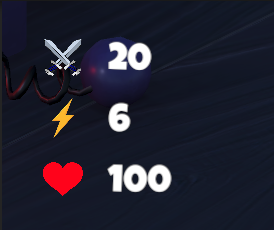
## Orbs
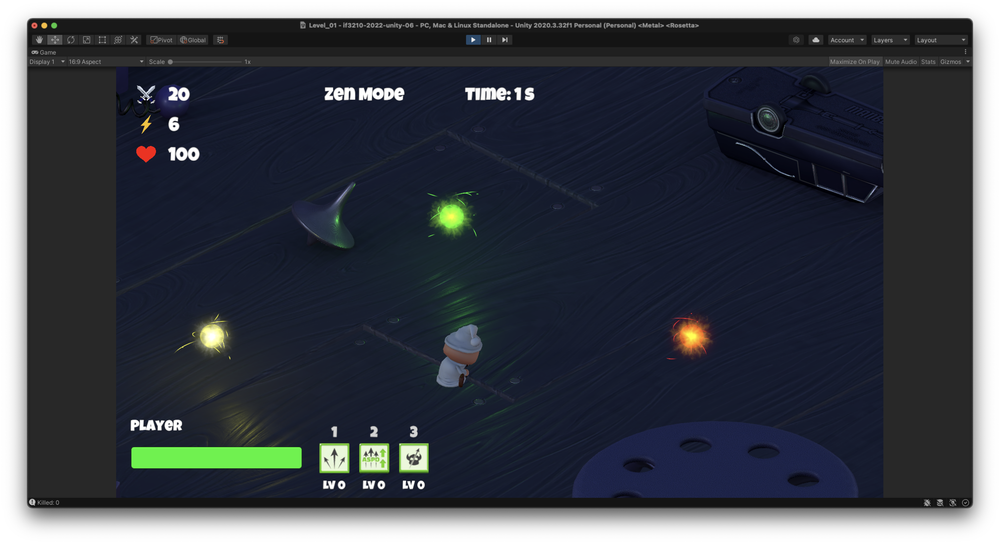
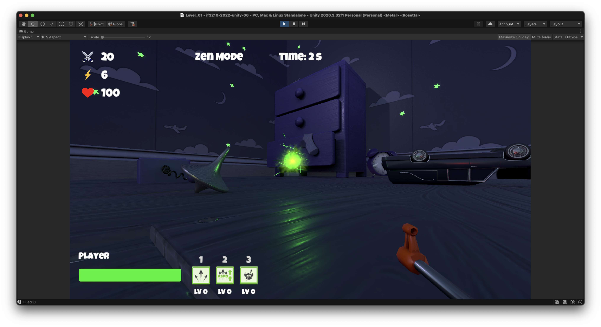
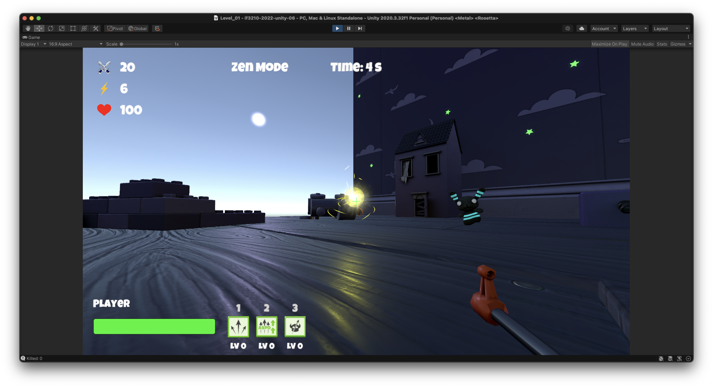
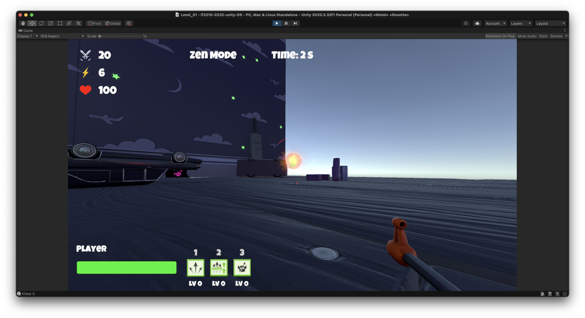
## Mobs
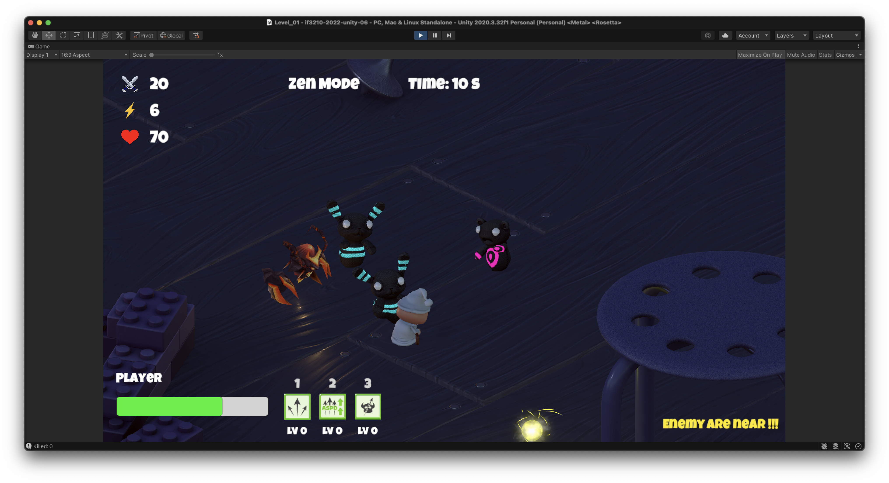
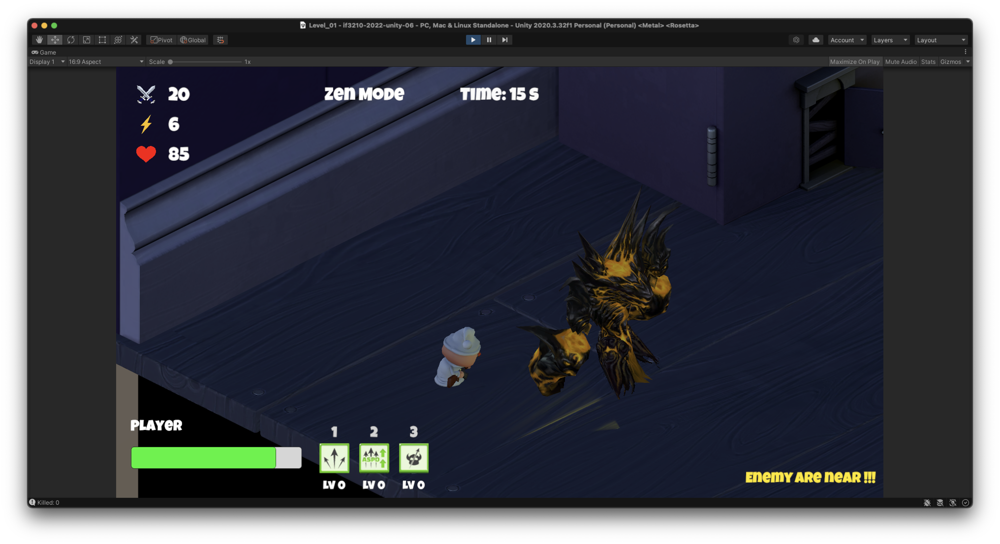
## Game Mode
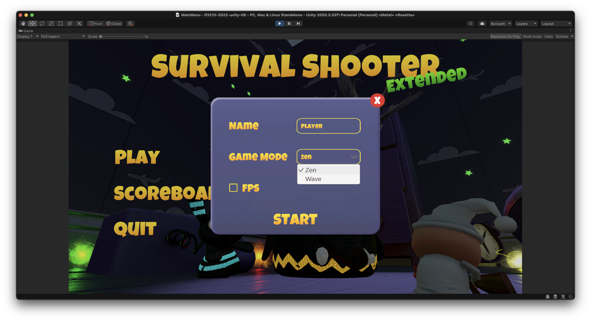
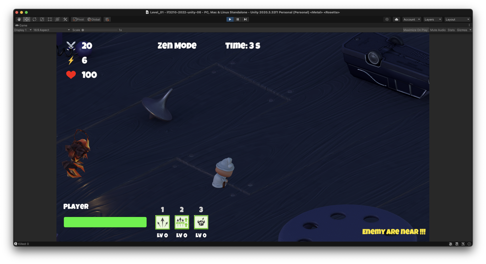
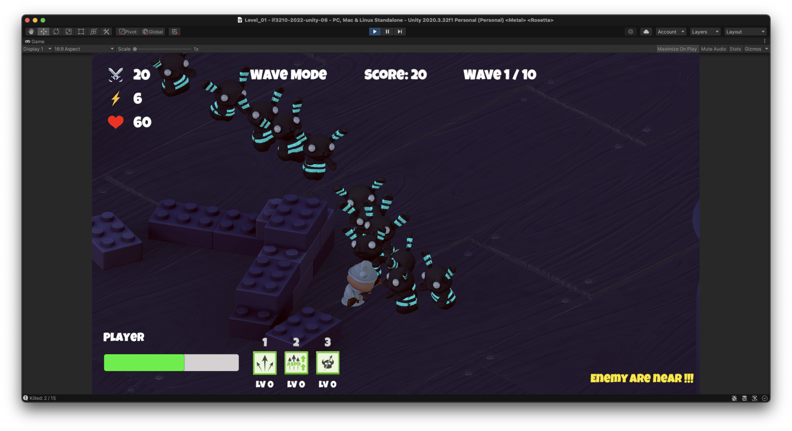
## Weapon Upgrade
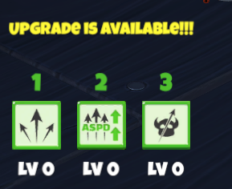
## Camera View
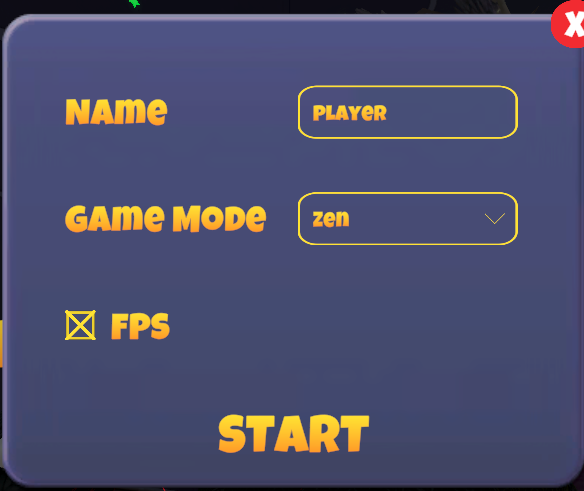
## Local Scoreboard
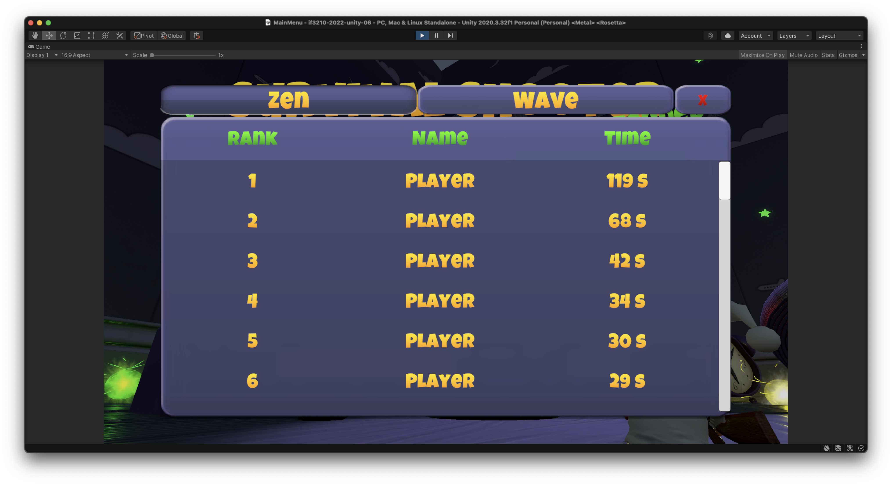
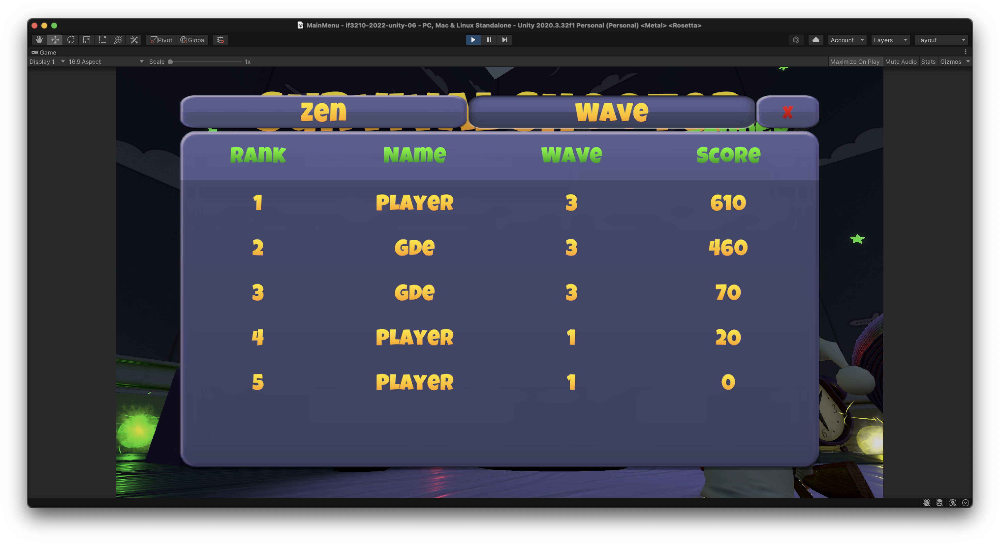
## Main Menu
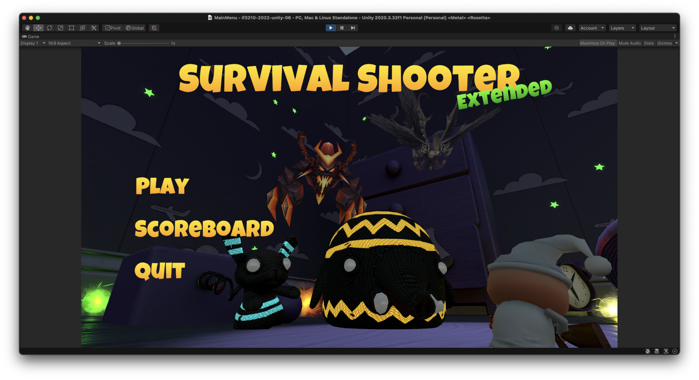
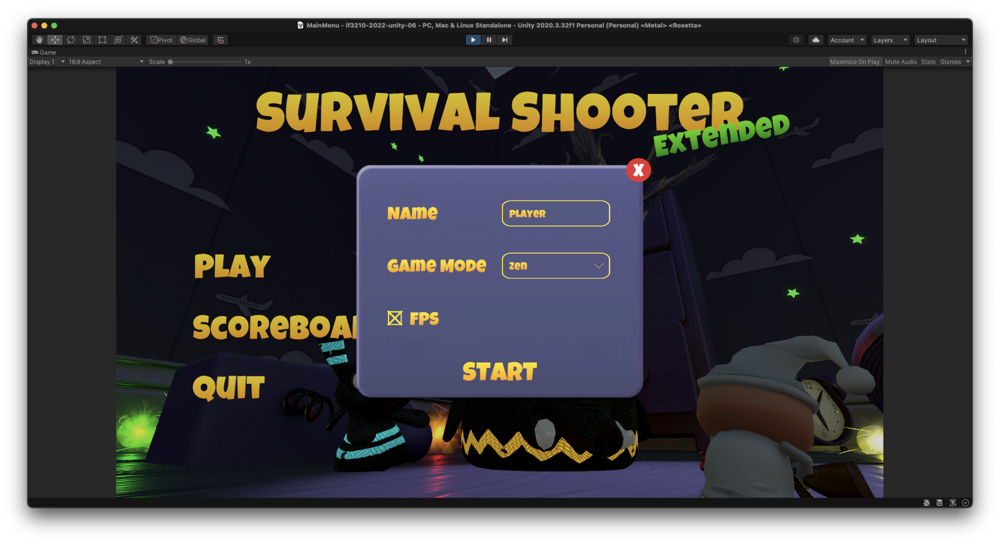
## Game Over
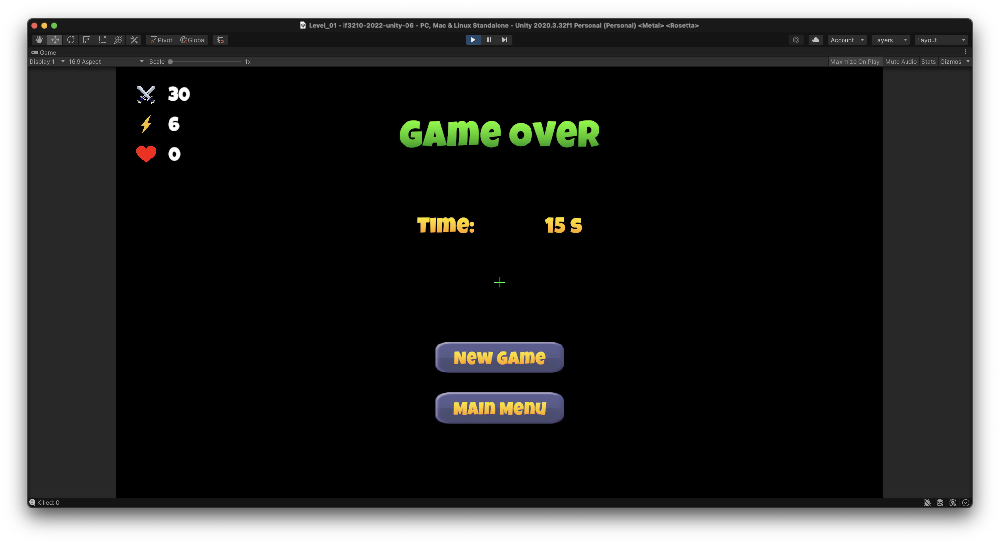
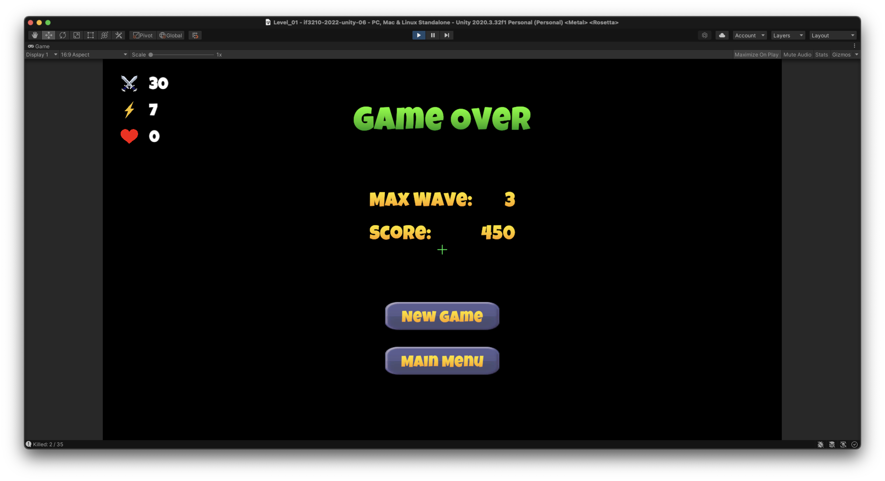

# Pembagian Kerja 
1. 13519026 - Gde Anantha Priharsena 
   - Attribute Player
   - Orbs
   - Additional Mobs
2. 13519043 - Reihan Andhika Putra
   - Game Mode
   - Weapon Upgrade
3. 13519167 - Reyhan Emyr Arrosyid
   - Local Scoreboard
   - Main Menu
   - Game Over
   - Bonus : Menambah Weapon Upgrade
   - Bonus : Menambah First Person Mode
